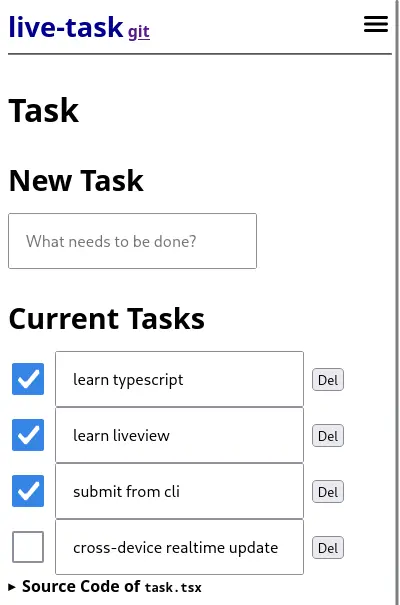

# WebApp 開發學習小組 (面向新手)

👋 大家好，我是 Beeno。我在全職工作中是一個 WebApp fullstack 開發課程的導師。現在我想將我的知識分享給更多的人，所以我打算在個人時間裡，教導一些有興趣學習的人。

我正在帶領一個小型的學習群組，亦接受個別的學生。我們會從基礎的 HTML, CSS, JavaScript 開始學習，然後進一步研究後端開發，數據庫的建立與管理，以及如何利用雲端服務等。

如果你對 WebApp 開發感到好奇，或是想要學習新技能，歡迎加入。這不是商業課程，只是我個人想要分享的學習機會。

有興趣的朋友，或者有任何問題，可以直接留言或私訊我。期待和你一起在這個領域中學習和成長！

Youtube Playlist: https://www.youtube.com/playlist?list=PLH2rXoLSgZYd8R6LZ7nwxNzGmz3tBqVhq

Github Repo: https://github.com/webapp-study-group/public-repo

Facebook Event: https://www.facebook.com/events/1047846646458408

## Outline

### Session 1

> Introduction to web UI with HTML/CSS/JS

介紹用 HTML + CSS + JS 由零開始砌網頁 🌱

### Session 1.5

> Using Ionic to build mobile webapp layout

繼上一個 session 學過用 html 和 css 砌網頁，今次教大家用 ionic framework 這個 mobile SDK 來砌手機 webapp 界面。

今次比較多示範位，可以跟住做和嘗試不同的組合 💪

### Session 2

> Build your own web server in node.js with http module and express package

在第二節的前半部份，我們會淺嘗如何簡單使用 Node.js 中的 http 模組和 express 套件來建立基礎的網頁伺服器。

### Session 2.5

**淺嘗用 node.js 開發後台伺服器 (backend server) 和數據庫 (database)**

> Fullstack development with ts-liveview, covering frontend, backend, database, and realtime updates

在 session 2 的後半部份，我們會使用 ts-liveview 進行全端開發，包括前端、後端、資料庫和即時更新網頁應用程式上的內容。

### Session 3

> Practice fullstack development with Task Manager (Todo List)

在 session 3，我們用 "待辦事項清單" (todo list) 來練習全端開發 (fullstack development)。

主要 source files: [task.tsx](./session-3/server/app/pages/task.tsx)

routing files: [routes.tsx](./session-3/server/app/routes.tsx)

螢幕截圖:

### Session 4

> Exercise with HTML/CSS/JS

在 session 4 有兩位新朋友加入，我們用五個小練習重溫 HTML 和 JS。

[Exercise List](./session-4/README.md) | [小練習目錄](./session-4/README-zh-hk.md)

### 假期號外：網頁資料爬取、數據庫使用和網頁應用程式開發

> 一個逐步演示的示範，透過螢幕錄製展示了如何進行這些開發的步驟和方法。

詳細請看：[domestic-helper-hub 的 repository](https://github.com/webapp-study-group/domestic-helper-hub)

### Session 5

> 重溫 Javascript DOM API 和介紹方便的 library

在假期號外尾聲，我們 troubleshoot 了學員的 frontend 練習，並對 Javascript DOM API 溫故知新

詳細請看：[session-5/README.md](./session-5/README.md)
